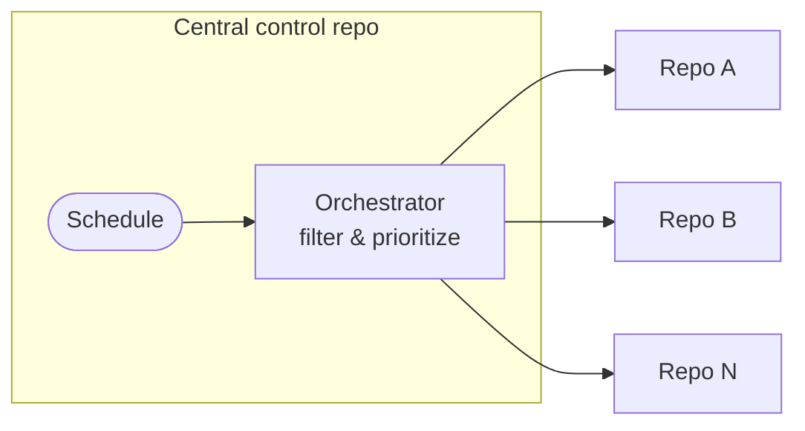
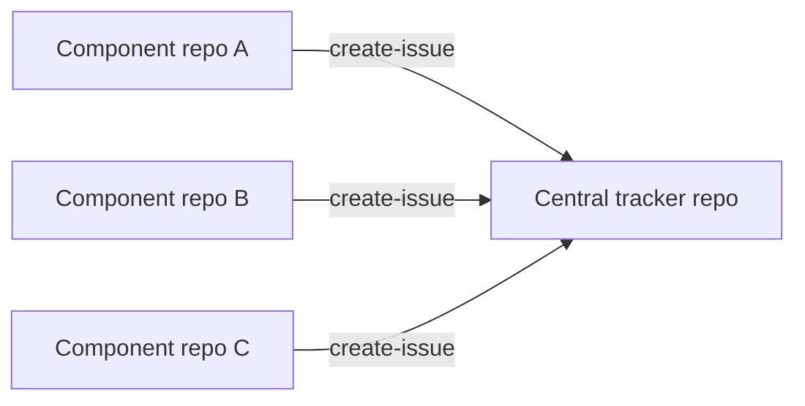

CentralRepoOps uses a single central repository to coordinate or aggregate activity across many other repositories. It is a sub-pattern of [MultiRepoOps](/gh-aw/patterns/multi-repo-ops/) and covers two deployment models: a **central control plane** where one repo dispatches work to many target repos for org-wide rollouts, security patches, and policy enforcement; and a **central tracker repo** where component repos each push events into a shared tracker for aggregated visibility and cross-project dashboards.

## Using a Central Control Repository

For large-scale operations — security patches, policy rollouts, configuration standardization — use a **single private repository as a control plane**. An orchestrator workflow filters and prioritizes targets, then dispatches per-repo worker workflows.



This pattern supports phased adoption (pilot waves first), central governance, security-aware prioritization, and a complete decision trail — without pushing `main` changes to individual target repositories.

**Orchestrator** (`dispatch-workflow` safe output + `max` limit):
```aw wrap
---
on:
  schedule: weekly on monday

tools:
  github:
    github-token: ${{ secrets.GH_AW_READ_ORG_TOKEN }}
    toolsets: [repos]

safe-outputs:
  dispatch-workflow:
    workflows: [worker-workflow]
    max: 5
---

# Rollout Orchestrator

Filter repositories, categorize by complexity, prioritize the rollout order, and dispatch the worker workflow for each selected repository. Summarize candidates, breakdown, and rationale.
```

**Worker** (`checkout` + `target-repo` safe outputs per dispatched repo):
```aw wrap
---
on:
  workflow_dispatch:
    inputs:
      target_repo:
        description: 'Target repository (owner/repo format)'
        required: true
        type: string

checkout:
  repository: ${{ github.event.inputs.target_repo }}
  github-token: ${{ secrets.ORG_REPO_CHECKOUT_TOKEN }}
  current: true

safe-outputs:
  github-token: ${{ secrets.GH_AW_CROSS_REPO_PAT }}
  create-pull-request:
    target-repo: ${{ github.event.inputs.target_repo }}
    max: 1
---

# Worker: Apply Changes to Target Repository

Analyze ${{ github.event.inputs.target_repo }}, apply the required changes, and create a pull request explaining what was changed and why.
```

Keep orchestrator permissions narrow; delegate repo-specific writes to workers. Add correlation IDs to dispatch inputs for tracking. See the [Dependabot Rollout example](/gh-aw/examples/multi-repo/dependabot-rollout/) for a complete end-to-end walkthrough.

## Using a Central Tracker Repository

Each component repository runs its own workflow that forwards events to a central tracker repo via `target-repo`. The central repository accumulates a unified view without needing direct access to individual component repos.



Useful for component-based architectures where multiple teams need a shared visibility layer, cross-project initiatives, or aggregating metrics from distributed repositories. See [Cross-Repo Issue Tracking](/gh-aw/examples/multi-repo/issue-tracking/) for a complete example.

## The Central Repo as an Agentic Factory

Beyond dispatching work and aggregating events, the central repository can serve as a **packaging envelope** for your entire suite of agentic processes. A single repository holds all the workflows your organization needs. Drop it into a new org, configure the required secrets, and it immediately starts running — no workflow reconstruction required.

This makes the central repo an **agentic factory**: a self-contained, production-ready bundle that any team can instantiate with minimal effort.

### Template Repository Structure

A factory repository is self-contained: the `README.md` is the activation manual, and the workflows under `.github/workflows/` are ready to run once secrets are configured.

```
agentic-workflows/
├── README.md                     # activation manual (secrets, setup, verify)
└── .github/
    └── workflows/
        ├── rollout.md            # org-wide rollout orchestrator
        ├── triage.md             # cross-repo issue triage
        ├── quality-monitor.md    # code quality monitoring
        ├── dependabot.md         # dependency management
        └── shared/
            ├── mcp-config.md     # shared MCP server definitions
            └── safety-policy.md  # shared safe-outputs policies
```

Mark the repository as a [GitHub template repository](https://docs.github.com/en/repositories/creating-and-managing-repositories/creating-a-template-repository) so anyone in the organization can instantiate a personal copy in one click without carrying over existing workflow runs or secrets.

### Secrets Checklist

The `README.md` should include a complete secrets checklist so anyone instantiating the factory knows exactly what to configure. A typical factory needs:

| Secret | Purpose |
| ------ | ------- |
| `ANTHROPIC_API_KEY` / `GEMINI_API_KEY` | AI engine for agent runs |
| `GH_AW_READ_ORG_TOKEN` | Read org metadata and repository list |
| `GH_AW_CROSS_REPO_PAT` | Write safe outputs to target repositories |
| `ORG_REPO_CHECKOUT_TOKEN` | Check out target repositories for workers |

> [!TIP]
> Use a GitHub App rather than PATs for cross-repository tokens where possible. GitHub Apps provide automatic token rotation and fine-grained per-repository scoping. See [Authentication](/gh-aw/reference/auth/) for setup.

### Activation: Drop In, Configure, Run

1. **Instantiate** — Create a new repository from the factory template in the target org (or fork it for independent configuration).
2. **Configure** — Add the required secrets to the new repository's **Settings → Secrets → Actions**.
3. **Enable Actions** — Confirm GitHub Actions is enabled for the repository and that scheduled workflows are not paused.
4. **Verify** — Trigger a `workflow_dispatch` on one workflow to confirm end-to-end connectivity before the first scheduled run fires.

Once secrets are in place, all scheduled workflows activate automatically and the factory is producing.

## Related Documentation

- [MultiRepoOps](/gh-aw/patterns/multi-repo-ops/) — Side repo and downstream sync patterns
- [Sharing Workflows in the Organization](/gh-aw/practices/sharing-workflows/) — Versioning, governance, and enterprise patterns
- [Dependabot Rollout](/gh-aw/examples/multi-repo/dependabot-rollout/) — End-to-end org-wide rollout example
- [Cross-Repo Issue Tracking](/gh-aw/examples/multi-repo/issue-tracking/) — Aggregated issue tracking example
- [Cross-Repository Safe Outputs](/gh-aw/reference/cross-repository/) — Configuration reference
- [Authentication](/gh-aw/reference/auth/) — PAT and GitHub App setup
