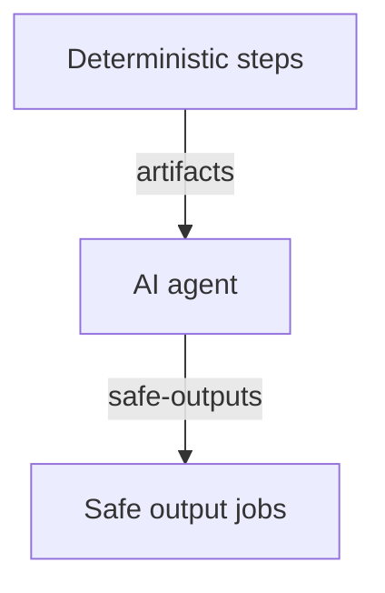

Combine deterministic [`steps:`](/gh-aw/reference/steps-jobs/#custom-steps-steps) and [`jobs:`](/gh-aw/reference/steps-jobs/#custom-jobs-jobs) with AI reasoning to precompute data, filter triggers, preprocess inputs, or post-process outputs. Useful for reporting, trend analysis, auditing, and any hybrid computation-and-reasoning pipeline.

## Example: Release Highlights Generator

This workflow generates release highlights for new tags. It uses deterministic steps to fetch structured data about the release and recent PRs, then the AI agent synthesizes this into a release summary.



Example workflow:

```yaml wrap title=".github/workflows/release-highlights.md"
---
on:
  push:
    tags: ['v*.*.*']

safe-outputs:
  update-release:

steps:
  - run: |
      gh release view "${GITHUB_REF#refs/tags/}" --json name,tagName,body > /tmp/gh-aw/agent/release.json
      gh pr list --state merged --limit 100 --json number,title,labels > /tmp/gh-aw/agent/prs.json
    env:
      GH_TOKEN: ${{ secrets.GITHUB_TOKEN }}
---

# Release Highlights Generator

Generate release highlights for `${GITHUB_REF#refs/tags/}`. Analyze PRs in `/tmp/gh-aw/agent/prs.json`, categorize changes, and use update-release to prepend highlights to the release notes.
```

Files in `/tmp/gh-aw/agent/` are automatically uploaded as artifacts and available to the AI agent. Pass data between jobs via artifacts, job outputs, or environment variables.

## Custom Trigger Filtering

### Inline Steps (`on.steps:`) — Preferred

Inject deterministic steps directly into the pre-activation job using `on.steps:`. This saves **one workflow job** compared to the multi-job pattern and is the recommended approach for lightweight filtering:

```yaml wrap title=".github/workflows/smart-responder.md"
---
on:
  issues:
    types: [opened]
  steps:
    - id: check
      env:
        LABELS: ${{ toJSON(github.event.issue.labels.*.name) }}
      run: echo "$LABELS" | grep -q '"bug"'
      # exits 0 (outcome: success) if the label is found, 1 (outcome: failure) if not

safe-outputs:
  add-comment:

if: needs.pre_activation.outputs.check_result == 'success'
---

# Bug Issue Responder

Triage bug report: "${{ github.event.issue.title }}" and add-comment with a summary of the next steps.
```

Each step with an `id` gets an auto-wired output `<id>_result` set to `${{ steps.<id>.outcome }}` — `success` when the step's exit code is 0, `failure` when non-zero. Gate the workflow by checking `needs.pre_activation.outputs.<id>_result == 'success'`.

To pass an explicit value rather than relying on exit codes, set a step output and re-expose it via `jobs.pre-activation.outputs`:

```yaml wrap
jobs:
  pre-activation:
    outputs:
      has_bug_label: ${{ steps.check.outputs.has_bug_label }}

if: needs.pre_activation.outputs.has_bug_label == 'true'
```

When `on.steps:` need GitHub API access, use `on.permissions:` to grant the required scopes to the pre-activation job:

```yaml wrap
on:
  schedule: every 30m
  permissions:
    issues: read
  steps:
    - id: search
      uses: actions/github-script@v8
      with:
        script: |
          const open = await github.rest.issues.listForRepo({ ...context.repo, state: 'open' });
          core.setOutput('has_work', open.data.length > 0 ? 'true' : 'false');

jobs:
  pre-activation:
    outputs:
      has_work: ${{ steps.search.outputs.has_work }}

if: needs.pre_activation.outputs.has_work == 'true'
```

See [Pre-Activation Steps](/gh-aw/reference/triggers/#pre-activation-steps-onsteps) and [Pre-Activation Permissions](/gh-aw/reference/triggers/#pre-activation-permissions-onpermissions) for full documentation.

### Multi-Job Pattern — For Complex Cases

When filtering needs heavy tooling (checkout, compiled tools, multiple runners), declare a separate `jobs:` entry instead of `on.steps:`:

```yaml wrap
jobs:
  filter:
    runs-on: ubuntu-latest
    outputs:
      should-run: ${{ steps.check.outputs.result }}
    steps:
      - uses: actions/checkout@v6
      - id: check
        run: ./scripts/should-run.sh && echo "result=true" >> "$GITHUB_OUTPUT"

if: needs.filter.outputs.should-run == 'true'
```

The compiler adds the filter job as a dependency of the activation job, so a false condition **skips** the run (not fails it), keeping the Actions tab clean.

### Simple Context Conditions

For conditions that can be expressed directly with GitHub Actions context, use `if:` without a custom job:

```yaml wrap
---
on:
  pull_request:
    types: [opened, synchronize]

if: github.event.pull_request.draft == false
---
```

### Query-Based Filtering

For conditions based on GitHub search results, use [`skip-if-match:`](/gh-aw/reference/triggers/#skip-if-match-condition-skip-if-match) or [`skip-if-no-match:`](/gh-aw/reference/triggers/#skip-if-no-match-condition-skip-if-no-match) in the `on:` section — these accept standard [GitHub search query syntax](https://docs.github.com/en/search-github/searching-on-github/searching-issues-and-pull-requests) and are evaluated in the pre-activation job, producing the same skipped-not-failed behavior:

```yaml wrap
---
on:
  issues:
    types: [opened]
  # Skip if a duplicate issue already exists (GitHub search query syntax)
  skip-if-match: 'is:issue is:open label:duplicate'
---
```

## Post-Processing Pattern

```yaml wrap title=".github/workflows/code-review.md"
---
on:
  pull_request:
    types: [opened]

safe-outputs:
  jobs:
    format-and-notify:
      description: "Format and post review"
      runs-on: ubuntu-latest
      inputs:
        summary: {required: true, type: string}
      steps:
        - ...
---

# Code Review Agent

Review the pull request and use format-and-notify to post your summary.
```

## Importing Shared Instructions

Define reusable guidance in shared files and import them:

```yaml wrap title=".github/workflows/analysis.md"
---
on:
  schedule: daily

imports:
  - shared/reporting.md

safe-outputs:
  create-discussion:
---

# Daily Analysis

Follow the report formatting guidelines from shared/reporting.md.
```

For daily discussion-based audit workflows, prefer `shared/daily-audit-base.md` to bundle discussion publishing, reporting guidance, and OTLP observability in a single import.

## DataOps: Scheduled Data Extraction and Analysis

Use `steps:` to collect and preprocess data deterministically, then let the agent analyze and report on the results. This is especially useful for scheduled reporting, trend analysis, and auditing workflows.

### Example: Weekly PR Activity Summary

````aw wrap
---
name: Weekly PR Summary
description: Summarizes pull request activity from the last week
on:
  schedule: weekly
  workflow_dispatch:

permissions:
  contents: read
  pull-requests: read

strict: true

network:
  allowed:
    - defaults
    - github

safe-outputs:
  create-discussion:
    title-prefix: "[weekly-summary] "
    category: "announcements"
    max: 1
    close-older-discussions: true

tools:
  bash: ["*"]

steps:
  - name: Fetch recent pull requests
    env:
      GH_TOKEN: ${{ secrets.GITHUB_TOKEN }}
    run: |
      mkdir -p /tmp/gh-aw/pr-data

      gh pr list \
        --repo "${{ github.repository }}" \
        --state all \
        --limit 100 \
        --json number,title,state,author,createdAt,mergedAt,closedAt,additions,deletions,changedFiles,labels \
        > /tmp/gh-aw/pr-data/recent-prs.json

  - name: Compute summary statistics
    run: |
      cd /tmp/gh-aw/pr-data

      jq '{
        total: length,
        merged: [.[] | select(.state == "MERGED")] | length,
        open: [.[] | select(.state == "OPEN")] | length,
        closed: [.[] | select(.state == "CLOSED")] | length,
        total_additions: [.[].additions] | add,
        total_deletions: [.[].deletions] | add,
        top_authors: ([.[].author.login] | group_by(.) | map({author: .[0], count: length}) | sort_by(-.count) | .[0:5])
      }' recent-prs.json > stats.json

timeout-minutes: 10
---

# Weekly Pull Request Summary

Analyze the prepared data:
- `/tmp/gh-aw/pr-data/recent-prs.json` - Last 100 PRs with full metadata
- `/tmp/gh-aw/pr-data/stats.json` - Pre-computed statistics

Create a discussion summarizing: total PRs, merge rate, code changes (+/- lines), top contributors, and any notable trends.
````

### Variations

- **Caching** — add a `cache:` block to reuse data across runs:

  ```yaml wrap
  cache:
    - key: pr-data-${{ github.run_id }}
      path: /tmp/gh-aw/pr-data
      restore-keys: pr-data-
  ```

- **Multiple sources** — fetch from several APIs and combine with `jq -s`:

  ```yaml wrap
  steps:
    - run: gh pr list --json ... > /tmp/gh-aw/prs.json
    - run: gh issue list --json ... > /tmp/gh-aw/issues.json
    - run: jq -s '{prs: .[0], issues: .[1]}' /tmp/gh-aw/*.json > /tmp/gh-aw/combined.json
  ```

## Subagents with Smaller Models

Delegate narrow, repetitive reasoning (categorization, per-item summarization, sentiment scoring) to **inline sub-agents** running a smaller, cheaper model. The main agent reads their results and synthesizes the final output.

```
steps:          → deterministic shell commands (fast, reproducible, zero AI cost)
sub-agents:     → small-model agents for per-item analysis  (cheap, parallelizable)
main agent:     → orchestrates sub-agents, synthesizes final report (high-reasoning)
```

Enable inline sub-agents by adding `cli-proxy` so they can make authenticated GitHub API calls:

```yaml
tools:
  cli-proxy: true
```

### Example: Issue Triage with Categorization

```aw wrap
# Weekly Issue Triage

The raw issue data is in `/tmp/gh-aw/triage/` — one file per issue (`issue-<number>.json`).

## Step 1 — categorize each issue

For every file matching `/tmp/gh-aw/triage/issue-*.json`, use the `issue-categorizer`
agent to classify it. Write the result to `/tmp/gh-aw/triage/category-<number>.json`.

## Step 2 — summarize each issue

For every issue file, use the `issue-summarizer` agent to produce a one-sentence
summary. Write the result to `/tmp/gh-aw/triage/summary-<number>.json`.

## Step 3 — synthesize triage report

Read all category and summary files, then create a discussion that groups issues
by category, lists each with its one-sentence summary and a link to the issue,
and highlights the top 3 issues that need the most urgent attention.

## agent: `issue-categorizer`
---
description: Classifies a GitHub issue into exactly one category
model: claude-haiku-4.5
---
Classify the issue into exactly one of: bug, feature-request, question, documentation, performance, security, or other.
Return a JSON object: `{"number": <issue number>, "category": "<category>"}`.

## agent: `issue-summarizer`
---
description: Produces a one-sentence summary of a GitHub issue
model: claude-haiku-4.5
---
Write a single sentence (≤ 20 words) that describes what the issue is about.
Return a JSON object: `{"number": <issue number>, "summary": "<sentence>"}`.
```

| Layer | Model | Work done | Cost driver |
|---|---|---|---|
| `steps:` | — | Fetch + prepare data | GitHub API only |
| `issue-categorizer` | Haiku / small | Classify one issue | ~200 tokens per issue |
| `issue-summarizer` | Haiku / small | Summarize one issue | ~150 tokens per issue |
| Main agent | Full model | Read all results, write report | One high-quality pass |

## Related Documentation

- [Custom Safe Outputs](/gh-aw/reference/custom-safe-outputs/) — Custom post-processing jobs
- [Compilation Process](/gh-aw/reference/compilation-process/) — How jobs are orchestrated
- [Imports](/gh-aw/reference/imports/) — Sharing configurations across workflows
- [Frontmatter Reference](/gh-aw/reference/frontmatter/) — Configuration options
